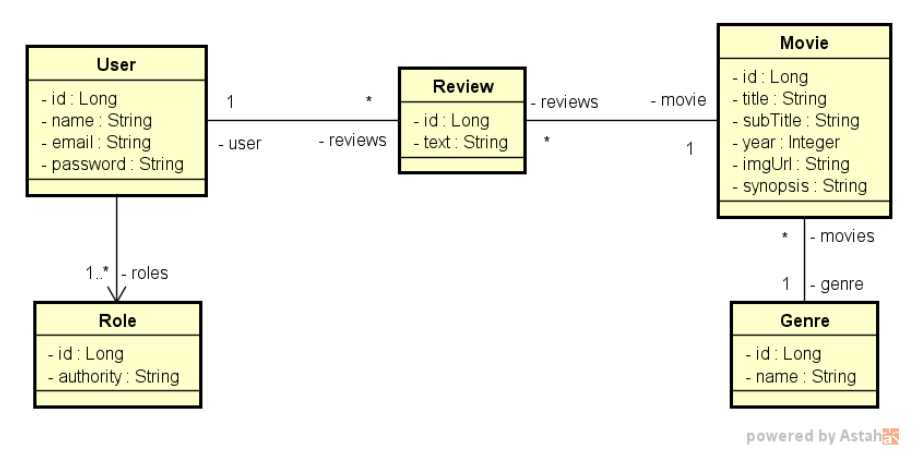
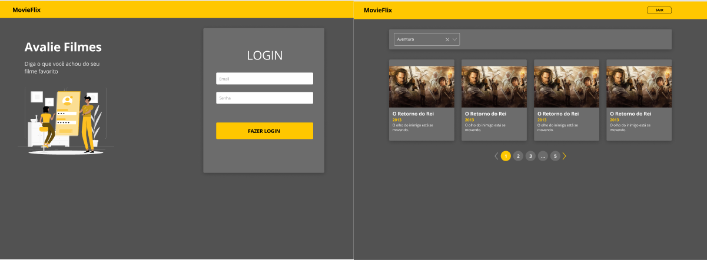
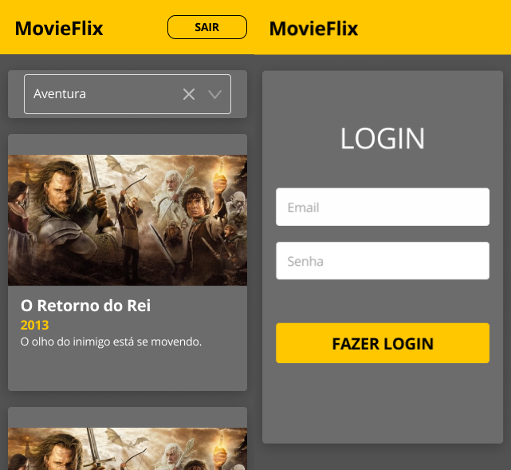

# MovieFlix
The project is a challenge passed by the [DevSuperior](https://devsuperior.com.br/) That aims to put into practice everything that is being taught. The project consists of an App, webpage and a java backend with SpringBoot.\
The system contains a database of films, where they will be listed and validated. When accessing the platform, the user will be able to see a list of films and it is possible to select by category, when selecting the film, the user will be able to make an evaluation and for that he must have the profile as a Member.\
The project will follow the following chronology:
* Rest API development in Java with SpringBoot;
* Web Application;
* App Android and iOS.

## Backend conceptual model

Font: DevSuperior

## Web and Mobile prototype images made in figma

Font: DevSuperior
\
\

Font: DevSuperior

## The project is being divided into the following stages: 
* Backend development which is in java language with Spring Boot framework;
* The frontend will be developed in JavaScript/TypeScript together with Framework React js.
* The application will be developed in React Native using Expo-cli, whose language is JavaScript, but TypeScript will be used because of the superset it incorporates into JavaScript, among them would be the static typing of variables.

### To run the backend you must have installed one of the following tools:

Spring Tools Suite or IntelliJ IDEA;\
Link showing how to import the project into STS: Channel Youtube Kidson The Tech Pro [Import_Project](https://www.youtube.com/watch?v=aE-aH6bnPSc&ab_channel=KindsonTheTechPro)\
Link showing how to import the project into IntellijIDE: Site JetBrains [Import_Project](https://www.jetbrains.com/help/idea/import-project-or-module-wizard.html#import-project)

### O que já foi implementado ou será implementado.

- [x] Entities
- [ ] Repositories
- [ ] Config Aouth2
- [ ] Custom Exception Service
- [ ] Custom Exception Resource
- [ ] Class DTO
- [ ] Services
- [ ] Resources